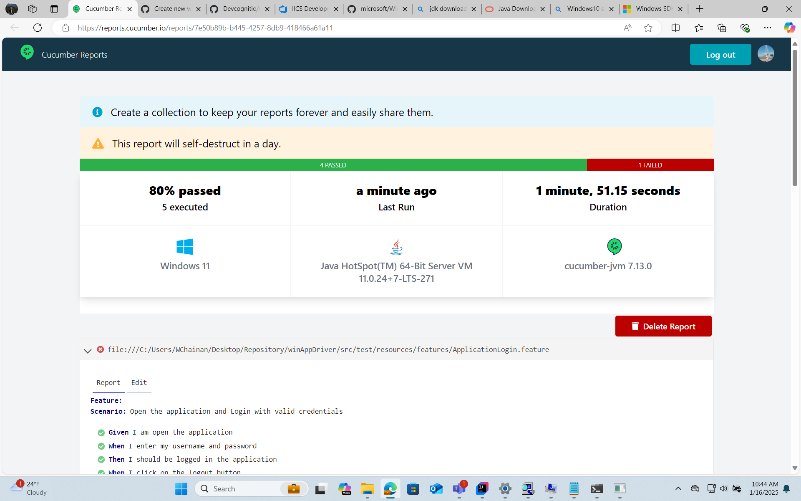

## WebAppDriver with JAVA and Cucumber POC Framework
This is a POC framework for WebAppDriver with JAVA and Cucumber.
Windows Application Driver (WinAppDriver) is a service to support Selenium-like UI Test Automation on Windows Applications. This service supports testing **Universal Windows Platform (UWP)**, **Windows Forms (WinForms)**, **Windows Presentation Foundation (WPF)**, and **Classic Windows (Win32)** apps on **Windows 10 PCs**.

------------------------------------------------------------------------------------------------------------------------------------------------------------------------------------------------------------------------------------------------------------------------------------------------------------------------------------
## Pre Requisites to run the project
1. Install Java 8 or above <https://www.oracle.com/java/technologies/downloads/>
   How to setting up JAVA_HOME and PATH in Windows
    - Right-click on My Computer and select Properties.
          
    - On the Advanced tab, select Environment Variables, and then edit JAVA_HOME to point to where the JDK software is located, for example, C:\Program Files\Java\jdk1.8.0_02.
          
    - In the same dialog, update Path to include the path to the bin folder in the JDK path, for example, C:\Program Files\Java\jdk1.8.0_02\bin.
          
    - Open a new Command Prompt window and check that your JAVA_HOME and Path are set correctly by typing java -version, javac -version, and mvn -version.
          
    - If you have installed the JDK in Program Files, the path probably is C:\Program Files\Java\jdk1.8.0_02.
   
2. Install Maven 3.6.3 or above
3. Install Intellij IDEA

### Download (preferably a stable version) WinAppDriver:
- Download the WindowsApplicationDriver.msi file and install it, it is recommended to leave the default path.
- Enable Developer Mode in Windows -> Settings -> Search for "Developer Settings" -> Enable the Developer Mode checkbox.
- Download the Windows 10 SDK installer: <https://developer.microsoft.com/en-us/windows/downloads/windows-sdk/> Download Windows 10 SDK. Do not download the ISO.
Once the installer is downloaded, perform the installation, it is recommended to leave the default installation path.
Note: This tool provides us with the Inspector to map the objects of the desktop application we want to work with.

After installing, navigate to the directory where WinAppDriver was installed and run WinAppDriver.exe.
By default, the path should be: C:\Program Files (x86)\Windows Application Driver.  
A console should open with the following message:
       

### Install & Run WinAppDriver
1. Download Windows Application Driver installer from <https://github.com/Microsoft/WinAppDriver/releases>
2. Run the installer on a Windows 10 machine where your application under test is installed and will be tested
3. Enable [Developer Mode](https://docs.microsoft.com/en-us/windows/uwp/get-started/enable-your-device-for-development) in Windows settings
4. Run `WinAppDriver.exe` from the installation directory (E.g. `C:\Program Files (x86)\Windows Application Driver`)

Windows Application Driver will then be running on the test machine listening to requests on the default IP address and port (`127.0.0.1:4723`). You can then run any of our [Tests](/Tests/) or [Samples](/Samples). `WinAppDriver.exe` can be configured to listen to a different IP address and port as follows:

```
WinAppDriver.exe 4727
WinAppDriver.exe 10.0.0.10 4725
WinAppDriver.exe 10.0.0.10 4723/wd/hub
```

> **Note**: You must run `WinAppDriver.exe` as **administrator** to listen to a different IP address and port.
Download (preferably a stable version) WinAppDriver:
- Download the WindowsApplicationDriver.msi file and install it, it is recommended to leave the default path.
- Enable Developer Mode in Windows -> Settings -> Search for "Developer Settings" -> Enable the Developer Mode checkbox.
- Download the Windows 10 SDK installer: Download Windows 10 SDK. Do not download the ISO.
Once the installer is downloaded, perform the installation, it is recommended to leave the default installation path.
Note: This tool provides us with the Inspector to map the objects of the desktop application we want to work with.
### Write an Automation Script
Now that you've successfully installed WinAppDriver, you can get started with [authoring your first automation script](./Docs/AuthoringTestScripts.md)!


### To create a testng.xml file to run the Maven tests

Follow these steps:  
- Create a file named testng.xml in the root directory of your project.  
- Add the following content to the testng.xml file:

<!DOCTYPE suite SYSTEM "http://testng.org/testng-1.0.dtd">
<suite name="Suite">
    <test name="Test">
        <classes>
            <class name="runner.TestRunner"/>
            <!-- Add other test classes here -->
        </classes>
    </test>
</suite>

This testng.xml file defines a test suite named "Suite" and a test named "Test". It includes the TestRunner class.
You can add other test classes by including additional <class> elements within the <classes> section.  
To run the tests using Maven, you can use the following command:

mvn test -DsuiteXmlFile=testng.xml

### Execution Result
The execution result will be displayed in the console or the specified report directory, depending on your Maven configuration.
  

### Supported APIs

See [here](./Docs/SupportedAPIs.md) for a list of supported APIs by WinAppDriver. API support may differ from Appium and other counterparts.

## FAQ & Documentation
Additional documentation on WinAppDriver and related topics can be found under [/Docs/](./Docs/), such as the following:
   - [Frequently Asked Questions](./Docs/FAQ.md) 
     - [General Development & Best Practices](./Docs/FAQ.md#general-development--best-practices) 
     - [Using with Appium](./Docs/UsingAppium.md)
   - [Running WinAppDriver in CI (with Azure Pipelines)](./Docs/CI_AzureDevOps.md) 
   - [Using UI Recorder](./Docs/UsingUIRecorder.md)
   - [Authoring Test Scripts](./Docs/AuthoringTestScripts.md)
   - [Using the Selenium Grid](./Docs/SeleniumGrid.md) 
   - [Running On a Remote Machine](./Docs/RunningOnRemoteMachine.md)

Reference Links: https://github.com/microsoft/WinAppDriver
